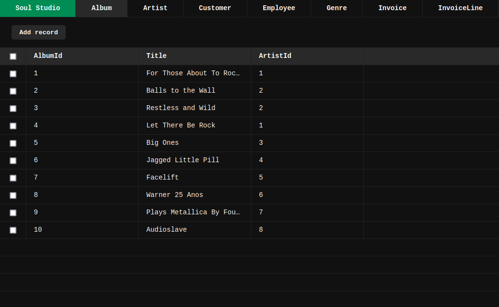

<p align="center">
    
    <p align="center">
        A SQLite REST and Realtime server
    </p>
</p>

[](https://justforfunnoreally.dev)
[](#contributors)
[](https://trackgit.com)

## Installation

Install Soul CLI with npm

```bash
  npm install -g soul-cli
```

## Usage

Soul is command line tool, after installing it,
Run `soul -d sqlite.db -p 8000` and it'll start a REST API on [http://localhost:8000](http://localhost:8000) and a Websocket server on [ws://localhost:8000](ws://localhost:8000).

```bash
Usage: soul [options]


Options:
      --version             Show version number                        [boolean]
  -d, --database            SQLite database file or :memory: [string] [required]
  -p, --port                Port to listen on                           [number]
  -r, --rate-limit-enabled  Enable rate limiting                       [boolean]
  -c, --cors                CORS whitelist origins                [string]
  -S, --studio              Start Soul Studio in parallel
      --help                Show help

```

Then to test Soul is working run the following command

```bash
curl http://localhost:8000/api/tables
```

It should return a list of the tables inside `sqlite.db` database.

## Documentation

API documentation is available while the project is running at [http://localhost:8000/api/docs](http://localhost:8000/api/docs)

There's also a list of all endpoints examples at [docs/api-examples.md](docs/api-examples.md)

For websocket examples, check [docs/ws-examples.md](docs/ws-examples.md)

## Extending Soul

Soul is able to be extended (e.g. Adding custom APIs) via extensions, you can find a list of extensions at [docs/extensions-examples.md](docs/extensions-examples.md)

## Soul-mates

A collection of projects that revolve around the Soul ecosystem.

- [Soul Studio](https://github.com/thevahidal/soul-studio) provides a GUI to work with your database.

    Right now Soul Studio is in early stages of development and not useful to work with.
    
    <p align="center">
        
    </p>

- [RCO-Soul](https://github.com/DeepBlueCLtd/RCO-Soul) The purpose of this project is to demonstrate how to run a React admin client using Soul as a REST API service.

## Development

```bash
git clone https://github.com/thevahidal/soul # Clone project

cp .env.sample .env # Duplicate sample environment variables
nano .env # Update the environment variables

npm install # Install dependencies
npm run dev # Start the dev server
```

## Community

[Join](https://bit.ly/soul-discord) the discussion in our Discord server and help making Soul together.

## License

[MIT](https://choosealicense.com/licenses/mit/)


## Contributing

Contributions are always welcome!

See `CONTRIBUTING.md` for ways to get started and please adhere to `CODE OF CONDUCT`.

## Contributors ✨

Thanks goes to these wonderful people ([emoji key](https://allcontributors.org/docs/en/emoji-key)):

<!-- ALL-CONTRIBUTORS-LIST:START - Do not remove or modify this section -->
<!-- prettier-ignore-start -->
<!-- markdownlint-disable -->
<table>
  <tbody>
    <tr>
      <td align="center" valign="top" width="14.28%"><a href="http://linktr.ee/thevahidal"><br /><sub><b>Vahid Al</b></sub></a><br /><a href="https://github.com/thevahidal/soul/commits?author=thevahidal" title="Code">💻</a> <a href="https://github.com/thevahidal/soul/pulls?q=is%3Apr+reviewed-by%3Athevahidal" title="Reviewed Pull Requests">👀</a></td>
      <td align="center" valign="top" width="14.28%"><a href="https://github.com/AbegaM"><br /><sub><b>Abenezer Melkamu</b></sub></a><br /><a href="https://github.com/thevahidal/soul/commits?author=AbegaM" title="Code">💻</a></td>
      <td align="center" valign="top" width="14.28%"><a href="https://github.com/IanMayo"><br /><sub><b>Ian Mayo</b></sub></a><br /><a href="https://github.com/thevahidal/soul/commits?author=IanMayo" title="Code">💻</a> <a href="https://github.com/thevahidal/soul/pulls?q=is%3Apr+reviewed-by%3AIanMayo" title="Reviewed Pull Requests">👀</a></td>
      <td align="center" valign="top" width="14.28%"><a href="https://godot.id"><br /><sub><b>Hanz</b></sub></a><br /><a href="https://github.com/thevahidal/soul/commits?author=HanzCEO" title="Code">💻</a></td>
      <td align="center" valign="top" width="14.28%"><a href="https://github.com/KoenDG"><br /><sub><b>Koen De Groote</b></sub></a><br /><a href="https://github.com/thevahidal/soul/commits?author=KoenDG" title="Code">💻</a></td>
      <td align="center" valign="top" width="14.28%"><a href="https://github.com/TahaKhanAbdalli"><br /><sub><b>Muhammad Taha Khan</b></sub></a><br /><a href="https://github.com/thevahidal/soul/commits?author=TahaKhanAbdalli" title="Code">💻</a></td>
    </tr>
  </tbody>
</table>

<!-- markdownlint-restore -->
<!-- prettier-ignore-end -->

<!-- ALL-CONTRIBUTORS-LIST:END -->

This project follows the [all-contributors](https://github.com/all-contributors/all-contributors) specification.
