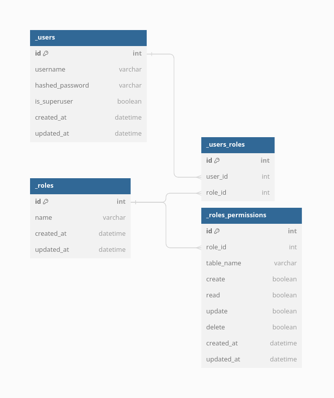

## User Authentication in Soul

Soul incorporates a robust user authentication system that handles user accounts, groups, permissions, and cookie-based user sessions. This section provides an overview of how the default implementation works.

### Overview

The Soul authentication system handles both authentication and authorization. Briefly, authentication verifies a user is who they claim to be, and authorization determines what an authenticated user is allowed to do. Here, the term "authentication" is used to refer to both tasks.

The auth system consists of:

- Users
- Roles and Permissions: A generic way of applying labels and permissions to more than one user.
- A password hashing system
- APIs for logging in users or restricting content
- JWT based access tokens

The authentication system in Soul aims to be very generic and doesn't provide some features commonly found in web authentication systems, such as:

- Password strength checking
- Throttling of login attempts
- Authentication against third-parties (OAuth, for example)
- Object-level permissions



<center style="font-size: 12px; color: gray">Figure 1: Soul Authentication Database Diagram</center>

#### Users

The `_users` table serves as the central component of the authentication system. Each row in the `_users` table represents an individual who interacts with your Soul instance. This table is crucial for enabling various functionalities, such as access restriction, and user registration.

**_Superusers_**, distinguished by the `is_superuser` attribute set to true, are a special type of user in Soul. They can bypass any permissions and restrictions, effectively granting them "God-mode" within the system. Authorization limitations do not apply to superusers.

The attributes of the `_users` table are:

- id int
- username varchar
- \_hashed_password varchar
- \_salt varchar
- is_superuser boolean
- created_at datetime
- updated_at datetime

Note that when Soul boots up, it looks for a table called `_users` (Otherwise Soul creates `_users` table) which holds the Users mentioned above.

##### Modifying Superusers

Due to the sensitive nature of the superuser status, it is not possible to change the `is_superuser` attribute of a user through the API.

Instead, you can update superusers using the command line.

```
$ node src/server.js updateuser --id=1 --password=newstrongstring // To update password of a superuser with id 1
$ node src/server.js updateuser --id=1 --is_superuser=true // To promote a user with id 1 to superuser
```

#### Roles

Roles are a generic way of categorizing users so you can assign permissions to those users. A user can belong to any number of roles.

If we have an `editor` role, and a `_roles_permissions` entry for the `posts` table that allows `update`, then any user with that role will be able to update `posts`.

The attributes of the `_roles` table are:

- id int
- name varchar
- created_at datetime
- updated_at datetime

##### Roles Permissions

Using a table called `_roles_permissions` we can assign permissions to roles.

The attributes of this table are:

- id int
- role_id int
- table_name varchar
- create boolean
- read boolean
- update boolean
- delete boolean

There is unique constraint on the combination of `role_id` and `table_name` attributes,
to prevent duplication of permissions for the same role and table.

###### Default Role

Once a new table is created, Soul will automatically create a new `_roles_permissions` row for the `default` role and the new table, with the following permissions:

- create: false
- read: true
- update: false
- delete: false

Which basically means that any user can read the table data, but can't create, update or delete data.

Soul uses the `default` role to assign permissions to new users.

The same happens when Soul boots up, but for all existing tables, making sure that all tables have the `default` role assigned to them.

##### Users Roles

To assign roles to users we have a join table called `_users_roles` with the following attributes:

- id int
- user_id int
- role_id int

#### Authentication

Soul uses cookies and middleware to hook the authentication system into request objects.

These provide a `req.user` attribute on every request, which represents the current user. If the current user has not logged in, it is set to null.

#### Obtain Access Token

To be able to use private APIs, users need to obtain an access token, which is a JWT token consisting of this payload:

- username
- is_superuser
- roles

For security reasons, Access tokens have a very short lifetime, and once expired, they can be refreshed using another API called Refresh Access token. Refresh tokens have a much longer lifetime, and both access and refresh tokens are provided to the user upon logging in.

#### Register New Users

To register new users, you need to create a new user using the `/api/tables/_users/rows/` endpoint, and then assign roles to that user using the `/api/tables/_users_roles/rows/` endpoint.
Note that you need to be logged in using a user with a role that has creating users permission.

Additionally, it's important to note that the `/api/tables/_users/rows/` endpoint functions slightly differently compared to other `/api/tables/<table_name>/rows/` endpoints. When creating or updating user data through this endpoint, we need to provide the raw passwords, which are then automatically hashed before being stored in the `_hashed_password` field. This extra step enhances the security of the stored passwords.

Furthermore, when retrieving user data, the endpoint automatically filters out sensitive information such as the `_hashed_password` and `_salt` fields. This precautionary measure is in place to address security concerns and ensure that only necessary and non-sensitive information is included in the returned results.
