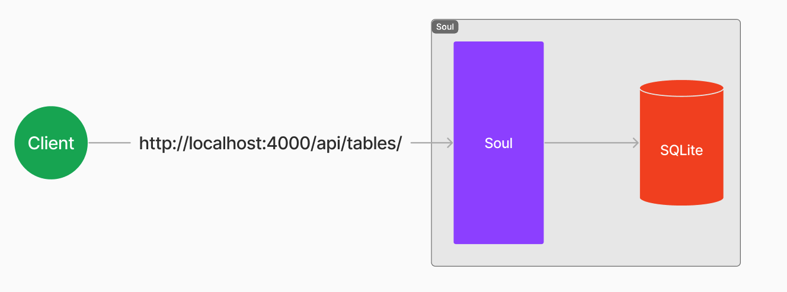
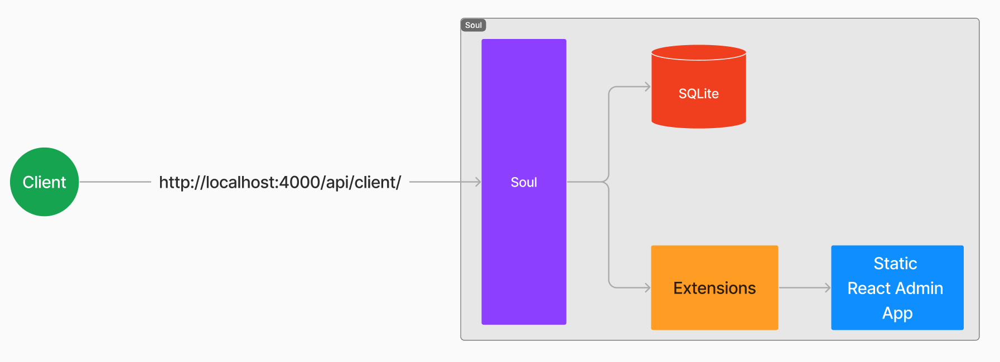

# Hosting Static Content Using Soul

You can host static content using Soul by utilizing its extensions feature. This allows you to expose your static application through Soul, simplifying the deployment.  Note: your application can gain further server-side capabilities via other Soul extensions.

Here are diagrams showing how to access Soul APIs when running standalone and how to expose a static client via extensions.

**Accessing Soul APIs**


**Accessing a React Admin Application via Soul**



## Steps

In this guide, we will demonstrate how to host a static `React Admin` application.

1. Create an `_extensions` folder within the `Soul` directory and add a file named `api.js`:
   ```sh
     mkdir _extensions && touch _extensions/api.js
   ```
2. Add the following code to the `api.js` file:

   ```js
   const reactAdminApp = {
     method: "GET",
     path: "/api/client",
     handler: (req, res, db) => {
       const clientPath = path.join(__dirname, "../dist", "index.html");
       res.app.use(express.static(path.join(__dirname, "../dist")));
       res.sendFile(clientPath);
     },
   };
   ```

3. Build your React Admin client:

   ```sh
      npm run build
   ```

4. Copy the `dist` folder from your `React Admin` project to the `_extensions` folder:

   ```sh
    cp -r dist <path/to/_extensions>
   ```

5. Run your Soul application:
   ```sh
    npm run dev
   ```
6. To verify that the app is working, open the following URL in your browser:
   ```
    http://localhost:<port>/api/client
   ```
